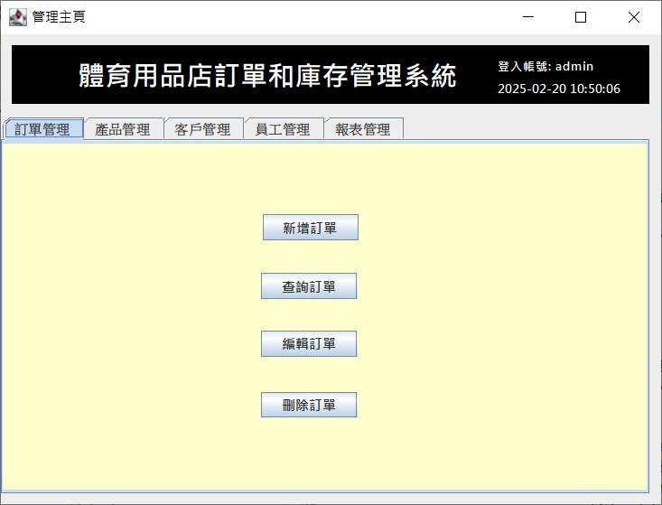
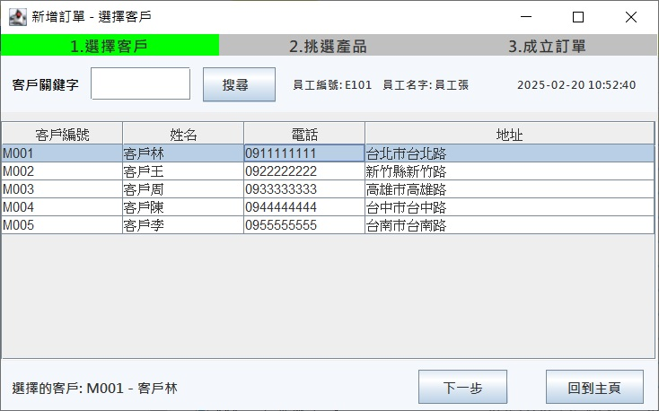
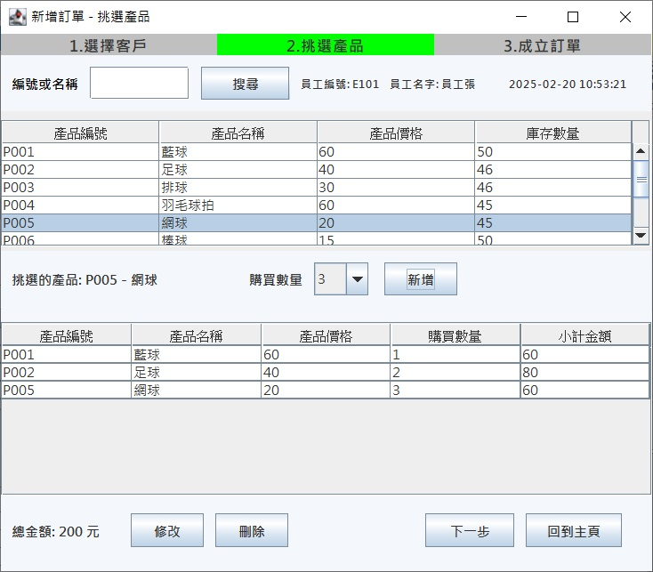
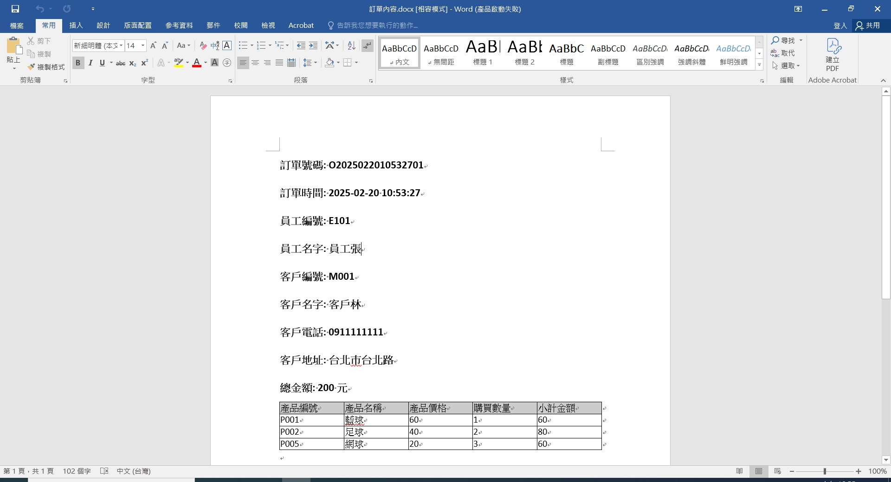
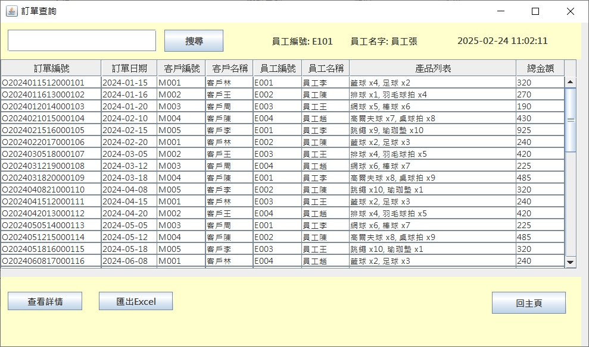
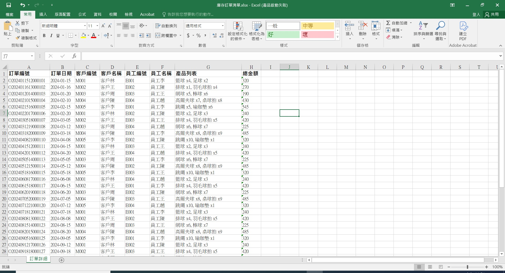
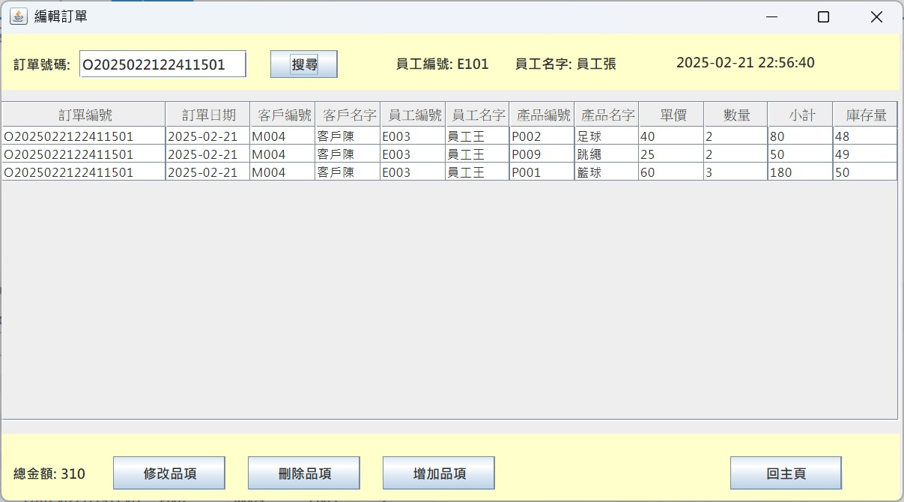
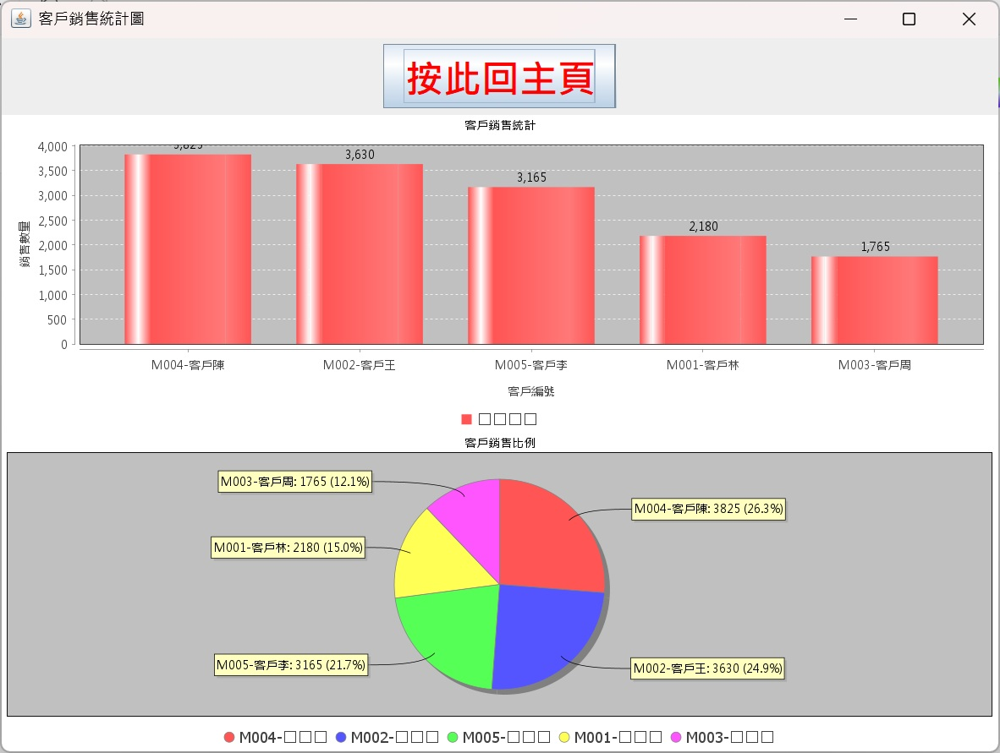
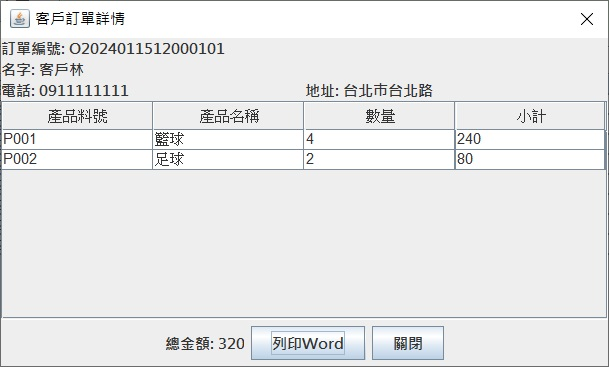

# 專案說明
這是一個訂單與庫存管理系統，主要功能包括：

1.訂單管理：新增、修改、刪除及查詢訂單。<br>
2.產品庫存管理：維護產品資訊，更新庫存數量。<br>
3.員工資料管理：管理員工帳戶與權限設定。<br>
4.會員資料管理：處理客戶註冊與資料維護。<br>
5.報表圖表管理：管理相關報表。<br>

## 程式設計
系統採用 MVC（Model-View-Controller） 設計模式，以確保架構清晰、可維護性高。此外，系統實作 DAO（Data Access Object）層 負責數據存取，並透過 Service 層 處理業務邏輯。後端使用 MySQL 作為資料庫，確保數據管理的穩定性與效率。

## 主頁的檔案說明如下
SQL: sql 檔 <br>
images: 使用畫面抓圖 <br>
src: 程式檔 <br>
Homework5.jar: 執行檔 <br>

## src 目錄結構
```src
├─controller
│  ├─customer
│  │      MemberMainUI.java
│  │      MemberReadDialog.java
│  │      MemberReadUI.java
│  │      
│  ├─employ
│  │      EmployManagerUI.java
│  │      EmployUpdateUI.java
│  │      
│  ├─member
│  │      MemberManagerUI.java
│  │      
│  ├─porder
│  │      PorderCreate1.java
│  │      PorderCreate2.java
│  │      PorderCreate3.java
│  │      PorderDeleteUI.java
│  │      PorderReadDialog.java
│  │      PorderReadUI.java
│  │      PorderUpdateUI.java
│  │      
│  ├─portal
│  │      LoginUI.java
│  │      MainUI.java
│  │      MemberLoginUI.java
│  │      PortalUI.java
│  │      RegisterUI.java
│  │      
│  └─product
│          ProductManagerUI.java
│          
├─dao
│  │  EmployDao.java
│  │  MemberDao.java
│  │  PorderDao.java
│  │  PorderSummaryDao.java
│  │  ProductDao.java
│  │  
│  └─impl
│          EmployDaoImpl.java
│          MemberDaoImpl.java
│          PorderDaoImpl.java
│          PorderSummaryDaoImpl.java
│          ProductDaoImpl.java
│          
├─model
│      Employ.java
│      Member.java
│      Porder.java
│      PorderSummary.java
│      Product.java
│      
├─service
│  │  EmployService.java
│  │  MemberService.java
│  │  PorderService.java
│  │  ProductService.java
│  │  
│  └─impl
│          EmployServiceImpl.java
│          MemberServiceImpl.java
│          PorderServiceImpl.java
│          ProductServiceImpl.java
│          
└─util
        DbConnection.java
        Tool.java

src 目錄檔案說明如下:

📂 controller（控制層 - 負責 UI 及業務邏輯）
這部分負責與使用者互動，使用 JFrame、JDialog 來設計介面，並與 Service 層 互動。

📁 customer（會員管理）
MemberMainUI.java → 會員主介面
MemberReadDialog.java → 會員資料詳細資訊的彈窗
MemberReadUI.java → 會員資料查詢介面

📁 employ（員工管理）
EmployManagerUI.java → 員工管理主介面
EmployUpdateUI.java → 員工資訊編輯介面

📁 member（會員管理）
MemberManagerUI.java → 會員管理介面（可能包含新增、刪除、修改功能）

📁 porder（訂單管理）
PorderCreate1.java → 訂單建立介面（可能是第一步）
PorderCreate2.java → 訂單建立介面（第二步）
PorderCreate3.java → 訂單建立介面（最終步驟）
PorderDeleteUI.java → 訂單刪除介面
PorderReadDialog.java → 訂單詳細資訊的彈窗
PorderReadUI.java → 訂單查詢介面
PorderUpdateUI.java → 訂單修改介面

📁 portal（登入、註冊、主選單）
LoginUI.java → 登入介面
MainUI.java → 系統主介面
MemberLoginUI.java → 會員登入介面
PortalUI.java → 入口介面（可能是登入或主選單）
RegisterUI.java → 註冊介面

📁 product（產品管理）
ProductManagerUI.java → 產品管理介面

📂 dao（資料存取層 - 直接與 MySQL 互動）
負責對 MySQL 進行 CRUD（新增、查詢、更新、刪除） 操作。
EmployDao.java → 員工資料存取介面
MemberDao.java → 會員資料存取介面
PorderDao.java → 訂單資料存取介面
PorderSummaryDao.java → 訂單摘要查詢
ProductDao.java → 產品資料存取介面

📁 impl（DAO 具體實作）
EmployDaoImpl.java → 員工 DAO 實作
MemberDaoImpl.java → 會員 DAO 實作
PorderDaoImpl.java → 訂單 DAO 實作
PorderSummaryDaoImpl.java → 訂單摘要 DAO 實作
ProductDaoImpl.java → 產品 DAO 實作

📂 model（數據模型 - 定義 POJO 類別）
對應 MySQL 的資料表，每個類別代表一個 表的結構。
Employ.java → 員工類別（對應 employ 資料表）
Member.java → 會員類別（對應 member 資料表）
Porder.java → 訂單類別（對應 porder 資料表）
PorderSummary.java → 訂單摘要類別（用於統計）
Product.java → 產品類別（對應 product 資料表）

📂 service（業務邏輯層 - 處理 DAO 操作）
負責調用 DAO，執行 交易管理（Transaction Management） 及 商業邏輯。
EmployService.java → 員工業務邏輯
MemberService.java → 會員業務邏輯
PorderService.java → 訂單業務邏輯
ProductService.java → 產品業務邏輯

📁 impl（Service 具體實作）
EmployServiceImpl.java → 員工 Service 實作
MemberServiceImpl.java → 會員 Service 實作
PorderServiceImpl.java → 訂單 Service 實作
ProductServiceImpl.java → 產品 Service 實作

📂 util（工具類別 - 提供共用函式）
DbConnection.java → MySQL 連線工具類
Tool.java → 其他工具函式，例如 檔案存取、格式轉換

📌 總結
這個 MVC 架構 的系統包含：
Controller（UI 介面） → controller 資料夾（使用 JFrame 來顯示介面）。
Model（資料模型） → model 資料夾（定義對應 MySQL 的類別）。
DAO（資料存取層） → dao 資料夾（負責 CRUD 操作）。
Service（業務邏輯層） → service 資料夾（處理 DAO 操作及交易管理）。
Util（工具類） → util 資料夾（提供 MySQL 連線與工具函式）。

```

## 使用手冊
### 1.匯入 MySQL Schema 和 Table

請下載 SQL 目錄的檔案，並按照以下步驟將其匯入 MySQL：

打開 MySQL Workbench。

連接到 MySQL 伺服器。

在左側資料庫樹狀中，選擇要匯入資料的資料庫。

在 MySQL Workbench 上方的「管理」標籤下，選擇 資料匯入。

選擇要匯入的檔案（例如 sportproject開頭的.sql）。

點擊 開始匯入。

匯入完成後，資料庫中的 Schema 和表格應已成功設置。

### 2.準備好 Java 11 可執行環境

以 Windows 10 為範例，請確保您已經安裝 Java 11。可以透過以下指令檢查 Java 環境是否已設置，在命令提示字元中執行：

C:\>javac -version

javac 11.0.20

C:\>java -version

java version "11.0.20" 2023-07-18 LTS

Java(TM) SE Runtime Environment 18.9 (build 11.0.20+9-LTS-256)

Java HotSpot(TM) 64-Bit Server VM 18.9 (build 11.0.20+9-LTS-256, mixed mode)

若能正確顯示版本資訊，代表您的 Java 環境已成功安裝。

### 3.下載執行檔

請下載 Homework5.jar 檔案。下載完成後，您只需點擊該檔案即可開啟程式。

### 4.使用畫面

介面架構


首頁


員工登入 


員工-訂單管理 



員工-新增訂單








員工-查詢訂單 






員工-編輯訂單 




員工-刪除訂單 


員工-產品管理 


員工-客戶管理 


員工-員工管理 


員工-報表管理




客戶登入


客戶-訂單管理


客戶-訂單管理





### 以上是專案說明
